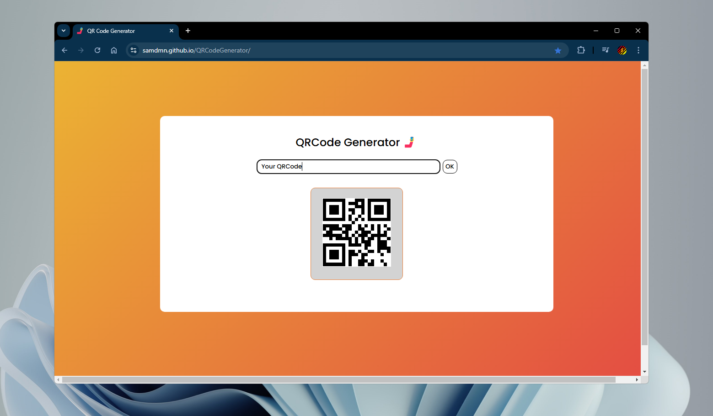

    English
    ·
    <a href="README_fr.md">Français</a>
    ·
    <a href="https://samdmn.github.io/QRCodeGenerator/">Official site</a>

# Introducing my QRCode Generator website !

**Thanks to this website, you can generate your own QR code from any text or any link.**

## Usage

Enter your text/link in the "Entrez un texte ou un lien" field. Then click the "OK" button or just press enter.  
You can generate as much codes as you want without refreshing the page.  
A QRCode is generated in the form of an image, which means you can click on it then download it.

## API

This website is using the [goqr.me API](https://goqr.me/api/). 