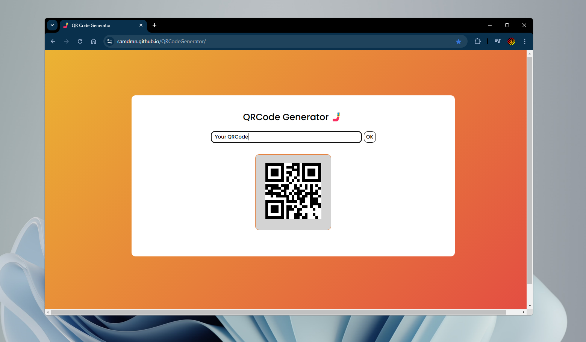

    <a href="README.md">English</a>
    ·
    Français
    ·
    <a href="https://samdmn.github.io/QRCodeGenerator/">Official site</a>

# Voici mon site générateur de QR Codes !

**Grâce à ce site, you pouvez générer votre propre QR code avec n'importe quel texte ou lien.**

## Utilisation

Entrez votre texte/lien dans la zone "Entrez un texte ou un lien". Puis cliquez sur le bouton OK ou appuyez sur Entrée.  
Vous pouvez générer autant de codes que vous le voulez sans rafraîchir la page.  
Un QR code est généré sous la forme d'une image, ce qui veut dire que vous pouvez cliquer dessus et le télécharger.

## API

Ce site utilise l'[API goqr.me](https://goqr.me/api/). 